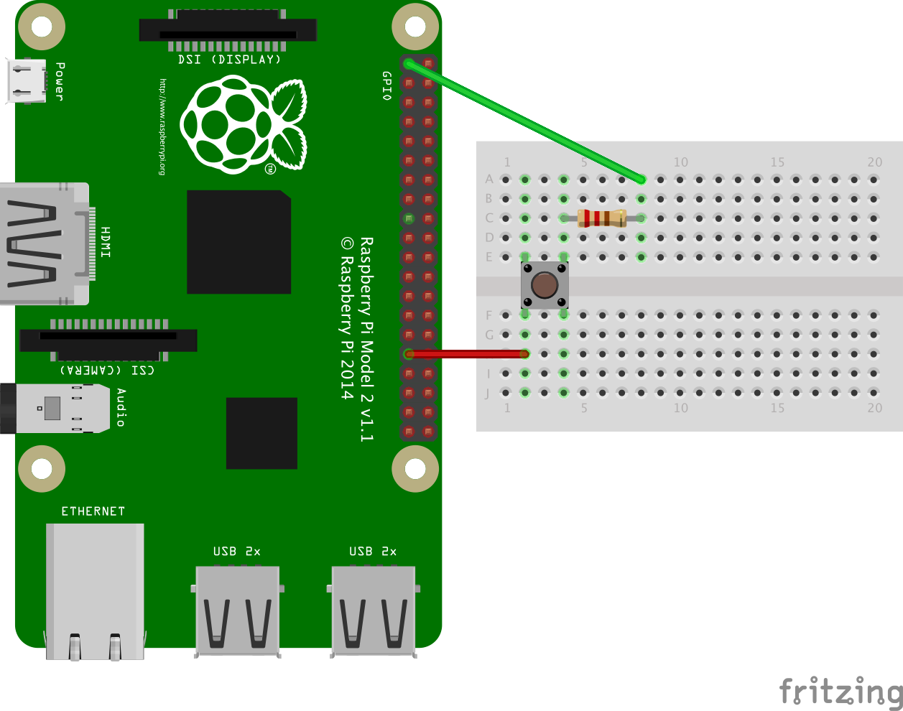

# Raspi_Buzzergame
Raspberry Pi und JavaFX (OpenJdk11) basiertes Multiplayer Buzzer Game mit GPIO

## Raspberry-Installation

1. Raspi-Image auf SD-Karte kopieren
2. Kühlkörper montieren und Raspi verkabeln (Monitor, Tastatur, Maus)
3. SD-Karte einstecken
4. Netzteil anschliessen -> entspricht "Power ON"
5. Installation abschliessen
6. Passwort ändern (für Benutzer pi)
7. WLAN konfigurieren
8. Updates installieren
	```
	sudo apt update
	sudo apt upgrade
	sudo apt install chromium-browser chromium-ublock-origin
	```
weitere Info: https://projects.raspberrypi.org/en/projects/raspberry-pi-getting-started

### Optionale Pakete
```
sudo apt install conky htop
sudo apt install xfce4 xfce4-whiskermenu-plugin xfce4-goodies xfce4-session  
```


## Raspi & GPIOs

### Bibliotheken installieren

```
sudo apt install wiringpi
sudo apt install rpi.gpio
```

**Mehr Info:** [hier](https://www.raspberrypi.org/documentation/usage/gpio/)

### Pin-Layout


**Achtung:**

1. Im Gegensatz zum Arduino sind die GPIO-Pins vom Raspi nicht kurzschlussgeschützt. Bei falscher Verkabelung kann der Raspi Schaden nehmen. Bitte nutzen Sie nur 3.3V-Anschlüsse.
1. Taster  mit Pulldown-Widerstand angeschliessen (sonst liest der Raspi nur Murks :-)




### Ausprobieren (mit Console)

Teile und herrsche, wenn Schaltung mit Terminal nicht funktioniert wird sie auch mit Java nicht funktionieren.

In der bash können GPIOs gelesen und geschrieben werden. Hier ein Beispiel zum Ansteuern des WiringPi Pin 24 als Ausgang:

```
gpio readall
gpio mode 24 OUT
gpio write 24 OFF
gpio write 24 ON
```


Weiter mit RaspiGpioDemo-Projekt...
